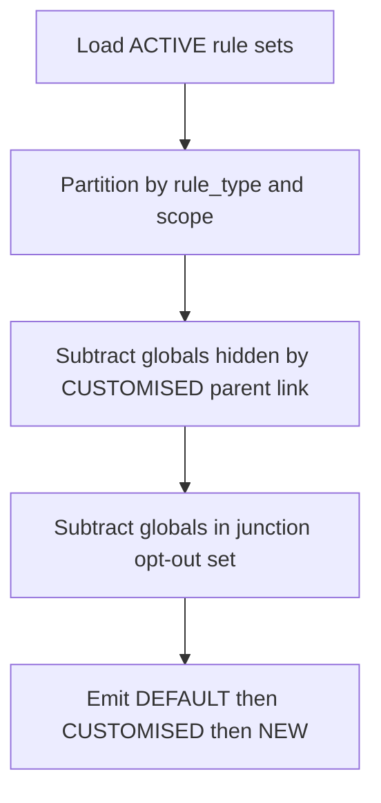
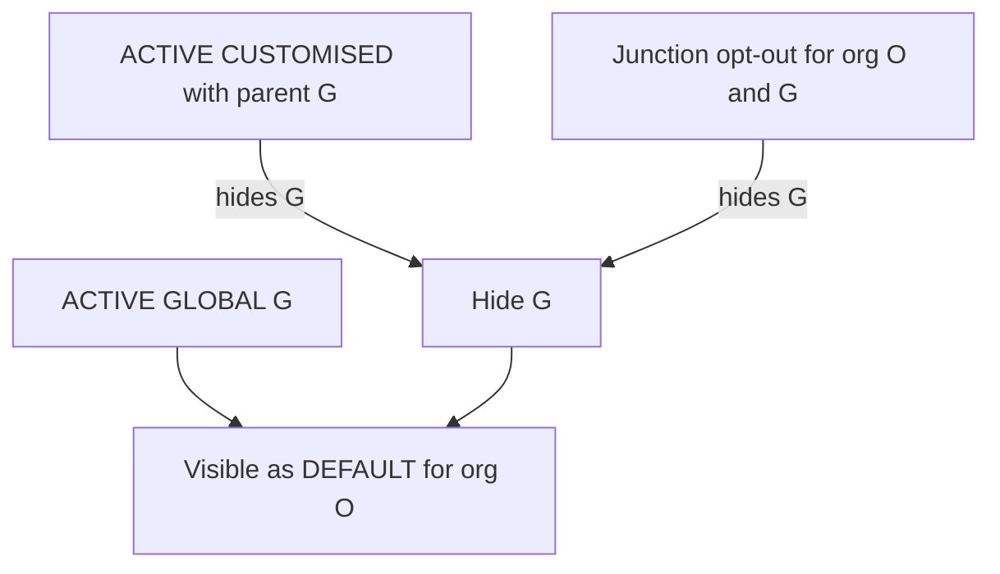

This document is the **implementation-ready plan** for letting admins manage **platform GLOBAL defaults vs organisation-specific behaviour**, including an optional **per-org opt-out** (“suppression”) for globals **only when product requires opt-out without a CUSTOMISED row**. It incorporates **security, safety, scalability, performance**, **edge cases**, **testing**, and **rollout**.

**Preferred product path (team):** If a **CUSTOMISED** row already exists for `(org, global parent)`, manage lifecycle only via **`restore-default`** and **`PATCH …/status`** on the ORG row—no duplicate concepts.

---

## 1. Scope and decisions

### 1.1 In scope

- **Effective-rule resolution** remains the **single source of truth** for: admin GET APIs, organisations suspension GET, **daily evaluation job**.
- **Optional feature:** Junction table **`org_suspension_global_suppressions`** (name final in migration) storing `(organization_id, global_rule_set_id)` with FK integrity—**only if** product needs “disable this global for this org” **without** creating a CUSTOMISED clone first.
- **Must-fix alongside any resolver change:** Fragile **`effect[0]`** heuristic after upsert (see §8).

### 1.2 Out of scope (unless separately approved)

- Customer **non-ADMIN** JWTs calling suspension mutation APIs (today suspension routes are **ADMIN-only**—keep parity).
- Changing **GLOBAL** `ACTIVE`/`INACTIVE` semantics platform-wide (still **Screen A / PATCH rule-set**).
- Rewriting the **metrics pipeline** (`_build_metrics`) beyond what effective-rule membership implies.

### 1.3 Product rules (customise-first)

1. **CUSTOMISED exists** for global `G` + org `O`: Use **`POST …/restore-default`** and **`PATCH …/orgs/{org_id}/rule-sets/{id}/status`** only—**do not** add a parallel “global off” toggle that duplicates meaning.
2. **No CUSTOMISED row** yet: Either **`POST …/customise`** then manage status, **or** (if shipped) **suppression PUT** for opt-out without clone—document which path FE uses.

### 1.4 Resolver semantics caveat (document or fix)

Effective resolution loads **only ACTIVE** `SuspensionRuleSet` rows. Therefore an **INACTIVE** CUSTOMISED row **does not participate** in overlay; the linked **GLOBAL may reappear** as DEFAULT for that org. If UX requires **“inactive customise keeps global hidden,”** implement an explicit resolver change or accept current semantics and align UI copy—record decision in ADR or ticket before GA.

---

## 2. Architecture

### 2.1 Single choke point

All consumers **must** call **`_effective_rule_sets_with_source_for_org`** (directly or via wrappers):

| Consumer | Location |
|----------|----------|
| Suspension rules REST | [`app/modules/suspension_rules/v1/routes.py`](app/modules/suspension_rules/v1/routes.py) |
| Organisations suspension REST | [`app/modules/organizations/v1/routes.py`](app/modules/organizations/v1/routes.py) |
| Daily job | [`SuspensionRulesService.run_daily_suspension_job`](app/modules/suspension_rules/service.py) |
| Upsert create-branch sourcing | [`upsert_org_rule_override`](app/modules/suspension_rules/service.py) |

**Rule:** Any filter for “which globals apply to org O” lives **only** in this resolver (+ prefetch helpers)—never duplicate logic in routes.

### 2.2 Deterministic resolution order

Apply **exactly this order** per `rule_type` bucket:

1. Load **ACTIVE** rule sets only (existing query)—unchanged predicate.
2. Partition **GLOBAL** vs **ORG** rows for org `O`.
3. **`suppressed_by_customised`** = set of `parent_global_rule_set_id` from **ACTIVE** ORG rows that have a parent link.
4. **`visible_globals`** = ACTIVE GLOBALs minus **`suppressed_by_customised`** (existing behaviour).
5. **If suppression feature shipped:** subtract **`suppressed_by_junction[O]`** (GLOBAL ids with a junction row for `O`).
6. Emit metadata rows: **DEFAULT** (each surviving global), then **CUSTOMISED**, then **NEW**—preserve stable ordering within kind (existing sort keys: `updated_at`, `created_at`).

Changing order changes semantics—add regression tests if refactored.

---

## 3. Data model (suppression track — optional)

### 3.1 Table sketch

- **`organization_id`** UUID FK → `organizations.id` **ON DELETE CASCADE** (org removal clears prefs).
- **`global_rule_set_id`** UUID FK → `suspension_rule_sets.id` **ON DELETE CASCADE** (global removal clears prefs).
- **Unique** `(organization_id, global_rule_set_id)`.
- **`created_at`** (audit); optional **`updated_at`** if rows updated in place vs delete/insert toggle.
- **Indexes:** `(organization_id)` for prefetch by org; optionally `(global_rule_set_id)` if bulk analytics needed.

### 3.2 Integrity

- App-layer validation: **`global_rule_set_id`** must reference **`scope_type = GLOBAL`** before insert—reject ORG ids (**400**).
- **Idempotent PUT:** `suppressed: true` → upsert; `false` → delete if exists—safe retries.

### 3.3 Interaction with CUSTOMISED

- If ACTIVE CUSTOMISED already hides `G`, junction row for `(O, G)` is **redundant**—resolver hides once; allow redundant junction **or** document dedupe job—correctness unaffected.

---

## 4. Security

### 4.1 Authorization

- **ADMIN-only** for list/get toggle endpoints—match existing [`SuspensionRulesServiceDep`](app/modules/suspension_rules/v1/routes.py) role checks (`UserRole.ADMIN`).
- **No elevation:** Org suspension endpoints must not bypass admin checks when mirrored under `organizations` router—verify [`AdminUserDep`](app/modules/organizations/v1/routes.py) on any new routes.

### 4.2 Abuse and invalid input

- **UUID format** validation on path params—reject malformed (**422**).
- **ORG vs GLOBAL:** Never accept ORG `rule_set_id` where GLOBAL expected (**400**).
- **Org existence:** Reject unknown `org_id` consistent with `_validate_scope` / **404** patterns used elsewhere.

### 4.3 Data exposure

- GET suppression list reveals **only ids** (and timestamps)—no cross-org leakage; scoped by **`organization_id`** in WHERE clause.
- Rate limiting: reuse existing **`SUSPENSION_RULES_READ_RATE_LIMIT` / WRITE** patterns on new routes.

---

## 5. Safety and operational risk

### 5.1 Migrations

- **Additive first:** Create table + indexes; deploy app second—empty table ⇒ **zero behaviour change**.
- **Downgrade:** Guard destructive downgrade if rows exist (Alembic pattern used elsewhere); avoid data loss without confirmation in runbooks.

### 5.2 Backward compatibility

- Existing mobile/admin clients that assumed “every global appears in effective list” may need FE updates—communicate as **behavioural** change when suppression ships, not necessarily API version bump if response shape unchanged.

### 5.3 Conflict with customise / restore

- **restore-default** does **not** delete junction rows—if both exist, global stays hidden until suppression cleared—**document** and test (§10).

### 5.4 Audit trail

- Log suspension mutations via existing **audit** patterns (`suspension_rule_set.*` parity): actor, org id, global id, action enable/disable.

---

## 6. Performance and scalability

### 6.1 Hot path cost

- **Per-org resolution** (API + job inner loop): **one extra query**—`SELECT global_rule_set_id FROM … WHERE organization_id = ?`—result set typically **tiny** (few globals per product area).
- **No N+1:** Prefetch suppression set **once** per `organization_id` before looping `rule_type` buckets—cache in local `set[str]` for the resolution call.

### 6.2 Daily job

- Today iterates **all ACTIVE org ids** then resolves rules—cost scales **O(orgs × globals)** dominated by existing metric queries; suppression prefetch adds **O(orgs)** queries unless batched in future optimisation (**not required v1** if query is indexed and cheap).

### 6.3 Database load

- Avoid loading full `suspension_rule_sets` twice—keep single query for ACTIVE rules + separate lightweight junction select.

---

## 7. Observability

- **Structured logs** on PUT suppression: `organization_id`, `global_rule_set_id`, `suppressed`, `actor_user_id` (no PII beyond ids).
- **Metrics (optional):** counter `suspension.global_suppression.toggle` with success/failure labels.
- **Evaluation runs:** existing `suspension_evaluation_runs` unchanged; behaviour change reflected indirectly via fewer fired rules—alert thresholds tuned after rollout.

---

## 8. Known implementation debt (must track)

### 8.1 Upsert response `global_rule_set_id` heuristic

[`upsert_org_rule_override`](app/modules/suspension_rules/service.py) and organisations PUT use **`effect[0]`** after effective fetch—**fragile** when ordering changes (suppression, multiple NEW rows). **Production fix:** derive `global_rule_set_id` explicitly (e.g. first `rule_kind == DEFAULT` in list, else `None`) or stop returning inferred global id.

---

## 9. API impact summary

### 9.1 Behaviour changes when suppression ships (same routes)

- **`GET …/suspension-rules/effective-rule-sets/{org_id}`** — fewer DEFAULT rows possible.
- **`PUT …/suspension-rules/orgs/{org_id}/rule-types/{rule_type}/override`** — sourcing + response mapping sensitive to ordering (**§8**).
- **`GET/PUT …/organizations/{org_id}/suspension-rules`** — mirror above.

### 9.2 New APIs (only if suppression shipped)

| Method | Path | Purpose |
|--------|------|---------|
| `GET` | `…/suspension-rules/orgs/{org_id}/global-rule-suppressions` | List suppressed global ids for FE merge. |
| `PUT` | `…/suspension-rules/orgs/{org_id}/global-rule-sets/{global_rule_set_id}/suppression` | Body `{ "suppressed": true \| false }`. |

### 9.3 Unchanged surfaces

Raw CRUD **`GET/PATCH/DELETE …/rule-sets/{id}`**, **`POST …/customise`**, org **`PATCH …/status`**, **`restore-default`**—signature unchanged; CASCADE cleans junction when GLOBAL deleted.

**Request validation and error codes for all mutations:** See **§11**.
---

## 10. Edge-case catalog (expanded)

| ID | Scenario | Expected |
|----|----------|----------|
| E1 | ACTIVE CUSTOMISED hides G | Junction redundant; idempotent OK |
| E2 | Suppress then customise same G | Double-hide OK |
| E3 | restore-default while junction exists | GLOBAL stays out of effective until junction cleared |
| E4 | All globals for type T suppressed; NEW ACTIVE | Evaluate NEW only for that type |
| E5 | All rules gone for type T | No automated evaluation for that pillar—document risk |
| E6 | Upsert with empty effective + no conditions | Existing ValidationError—unchanged |
| E7 | GLOBAL hard-deleted | Junction CASCADE; no orphans |
| E8 | GLOBAL INACTIVE | Not in ACTIVE query—junction row harmless |
| E9 | Concurrent PUT toggles | Last write wins—transactional boundaries |
| E10 | Wrong id type (ORG as global target) | **400** |

---

## 11. API validation matrix (production-grade)

All suspension-rules mutation endpoints remain **ADMIN-only**; non-admin → **403 Forbidden** (consistent with existing routes).

### 11.1 Cross-cutting

| Check | Failure |
|--------|---------|
| Valid UUID syntax for `org_id`, `rule_set_id`, `global_rule_set_id` path params | **422** (FastAPI/Pydantic) or **400** per project convention—**stay consistent** across module |
| Caller role **ADMIN** | **403** |
| Target **organization** exists when `org_id` is in URL | **404** `NotFoundError` or **400** `ValidationError`—match `_validate_scope` / existing org lookups |
| Optimistic locking (`version`) mismatch | **409 Conflict** where already implemented |

### 11.2 `PATCH …/orgs/{org_id}/rule-sets/{rule_set_id}/status`

| Rule | Error |
|------|--------|
| Rule set exists | **404** if unknown id |
| `scope_type === ORG` | **400** ValidationError — **reject GLOBAL** ids (“Only ORG-scoped rules … can be toggled”) |
| `scope_org_id === org_id` from URL | **400** — prevents cross-org tampering (**IDOR**) |
| `status` ∈ `{ ACTIVE, INACTIVE }` | **422** if enum invalid |
| `version` present and stale | **409** |

**FE guard:** Effective row `is_default_rule === true` ⇒ row id is GLOBAL ⇒ **must not** call this endpoint for “toggle default”; use platform PATCH, customise flow, or suppression (if shipped).

### 11.3 `POST …/orgs/{org_id}/rule-sets/{rule_set_id}/restore-default`

| Rule | Error |
|------|--------|
| Rule set exists | **404** |
| ORG scoped + `scope_org_id` matches URL `org_id` | **400** if GLOBAL or wrong org (**IDOR**) |
| `parent_global_rule_set_id` present (customised row) | **400** if NEW-only row (“Only customised rules …”) |
| Parent global still exists and `scope_type === GLOBAL` | **400** if broken FK/orphan (defensive) |

### 11.4 `POST …/orgs/{org_id}/rule-sets/{global_rule_set_id}/customise`

| Rule | Error |
|------|--------|
| `global_rule_set_id` references **GLOBAL** ACTIVE rule | **400** if ORG row |
| Org exists | **404**/validation per `_validate_scope` |
| No existing **ACTIVE** customised row for same `(org, parent)` | **409 Conflict** if duplicate (**ConflictError** today) |

### 11.5 `PUT …/orgs/{org_id}/rule-types/{rule_type}/override` (and organisations mirror)

| Rule | Error |
|------|--------|
| `rule_type` valid enum | **422** |
| On **create** branch: if effective source empty and `conditions` omitted | **400** existing ValidationError |
| `version` on update branch stale | **409** then retry semantics already in service—or document |

**Post-condition:** Fix **`effect[0]`** heuristic for response `global_rule_set_id` (**§8**)—validation of **response honesty**, not request body.

### 11.6 Suppression APIs — **if junction feature shipped**

| Endpoint | Rule | Error |
|----------|------|--------|
| `PUT …/global-rule-sets/{global_rule_set_id}/suppression` | Target row **GLOBAL** | **400** if ORG |
| Same | Org exists | **404**/400 |
| Same | Idempotent body (`suppressed` boolean required) | **422** if missing/invalid |
| **Optional product rule:** reject suppression when ACTIVE CUSTOMISED exists for same `(org, global)` | Avoid redundant state | **409 Conflict** with clear message **or** accept idempotent no-op (**200**)—**pick one**, document, test |

### 11.7 `PATCH …/rule-sets/{rule_set_id}` (global or org by id)

| Rule | Error |
|------|--------|
| Immutable fields not in payload | Already: **cannot** change `scope_type`, `scope_org_id`, `parent_global_rule_set_id` after create |
| Stale `version` | **409** |

### 11.8 Read endpoints (`GET effective`, `GET rule-sets`, `GET suppression list`)

| Rule | Error |
|------|--------|
| `org_id` for effective/suppression | Org exists recommended for consistent **404** vs empty list—**align with existing GET behaviour** |

### 11.9 Error payload consistency

- Use shared **`ValidationError`**, **`ConflictError`**, **`NotFoundError`** patterns so OpenAPI examples list **code + message + details** consistently.
- Extend [`docs.py`](app/modules/suspension_rules/v1/docs.py) per endpoint with **error catalog** (400 / 403 / 404 / 409 / 422).

### 11.10 Pytest additions for validation

- V1: PATCH status with **GLOBAL** id → **400**.
- V2: PATCH status with ORG id **belonging to another org** → **400**.
- V3: restore-default on **NEW** row → **400**.
- V4: customise duplicate active → **409**.
- V5: suppression PUT with ORG id as global → **400** (if shipped).

---

## 12. Pytest strategy (production-grade)

### 12.1 Resolver unit tests

- R1: Empty junction ⇒ identical to baseline (**regression**).
- R2–R3: Junction hides GLOBAL for org A only; org B unaffected.
- R4: Junction + CUSTOMISED same G—single hide.
- R5: restore-default + junction interaction (**E3**).
- R6: `rule_type` filter respects junction.
- R7: Ordering invariant across kinds after filter.

### 12.2 API integration tests

- A1–A2: PUT true/false + GET list consistency (**ADMIN** headers).
- A3–A4: **400/404** invalid ids.
- A5: Cross-route parity organisations vs suspension-rules GET effective.

### 12.3 Migration smoke

- M1: Upgrade creates constraints; downgrade guarded.

### 12.4 Non-functional

- Optional: benchmark resolver with/without junction prefetch on seed data—establish budget **&lt; few ms** added per org for API path.

---

## 13. Rollout checklist

1. Land migration in **staging**; verify empty table + full regression pytest green.
2. Land application code behind **feature flag** (optional) or direct enable if low risk.
3. Update [`docs/suspension_rules_screens_api.md`](docs/suspension_rules_screens_api.md) + OpenAPI [`docs.py`](app/modules/suspension_rules/v1/docs.py).
4. Communications: FE must merge **effective GET + suppression GET** if globals disappear from effective list.
5. Monitor audit logs + error rates post-deploy.

---

## 14. Implementation checklist

- [ ] Alembic migration + SQLAlchemy model + repository (`list_by_org`, upsert, delete).
- [ ] Resolver: prefetch junction set + filter `visible_globals`; unit tests R1–R7.
- [ ] REST routes + Pydantic schemas + rate limits + OpenAPI docs + **§11 validation + error catalog**.
- [ ] Audit events for toggle.
- [ ] Fix **`effect[0]`** upsert heuristic (**§8**) in suspension + organisations routes.
- [ ] Full pytest suite green; add tests §12 + **§11.10** validation cases.
- [ ] Docs: screen API + ADR for INACTIVE customise semantics (**§1.4**).

---

## 15. Diagram — effective visibility

---

## Document history

| Version | Change |
|---------|--------|
| 1 | Initial suppression + edge cases + API inventory |
| 2 | Production-grade expansion: security, perf, rollout, §8 debt, customise-first policy |
| 3 | §11 API validation matrix (IDOR, enums, 409/422), pytest V1–V5, checklist |
